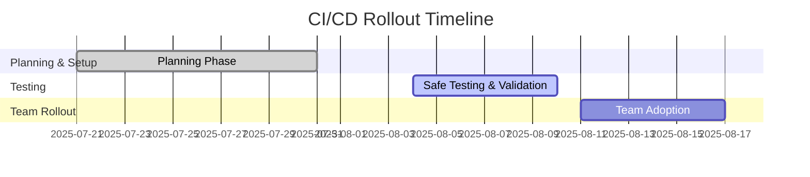

# 📊 CI/CD Implementation Progress Report
## SkilledUp.Life - For Non-Technical Stakeholders

---

> **Status**: In Progress | **Target**: September 1st Go-Live | **Risk Level**: Low

---

## 🎯 What We're Doing

**Goal**: Implement automated code quality checks to prevent bugs and ensure consistent code standards across our development team.

**Why This Matters**: 
- Prevents broken code from reaching production
- Ensures all developers follow the same coding standards
- Reduces time spent fixing preventable issues
- Helps us meet the September 1st deadline with higher quality

---

## 📈 Current Progress

### ✅ **Completed (Week 1 - July 21–31, 2025)**
- [x] **Planning Phase**: Created detailed implementation strategy
- [x] **Documentation**: Prepared step-by-step guides for developers
- [x] **Configuration Files**: Created standardized code quality rules
- [x] **Workflow Templates**: Built automated testing processes

### 🔄 **In Progress (Week 2 - August 4–10, 2025)**
- [ ] **Safe Testing**: Setting up a dedicated testing environment, fully isolated from live code
- [ ] **Developer Training**: One developer testing the new process in this environment
- [ ] **Validation**: Ensuring everything works without breaking existing code

### 📋 **Next Steps (Week 3 - August 11–17, 2025)**
- [ ] **Team Rollout**: Enable for all developers
- [ ] **Monitoring**: Track success and address any issues
- [ ] **Integration**: Connect with existing development workflow

---

## 🛡️ Risk Mitigation Strategy

### **Safe Approach**
- **Isolated Testing**: All changes are tested in a dedicated development environment, separate from live code. This approach has been used successfully on similar projects with zero downtime.
- **No Production Impact**: Current feature development continues uninterrupted on existing branches.
- **Easy Rollback**: We can disable the new system instantly if needed, reverting to the current process.
- **Gradual Rollout**: One developer at a time, not the entire team, to minimize disruption.
- **Warning-Based Approach**: During trial phase, we use warnings instead of blocking errors to avoid refactoring pressure.

### **What This Means for You**
- ✅ **No Code Rewriting**: We’re adding tools, not changing existing code.
- ✅ **No Development Delays**: The team continues working normally on features.
- ✅ **No September 1st Risk**: Implementation is separate from feature development, ensuring the deadline.
- ✅ **Quality Improvement**: Better code quality reduces production issues.

---

## 📊 Business Impact

### **Before Implementation**
- Manual code review process
- Inconsistent coding standards
- Potential for bugs to reach production
- Time spent fixing preventable issues

### **After Implementation**
- Automated quality checks
- Consistent code standards across team
- Bugs caught before reaching production
- More time for feature development

### **Timeline Impact**
- **Week 1-2 (July 21–August 10)**: Setup and testing (no impact on features)
- **Week 3 (August 11–17)**: Team adoption (minimal learning curve)
- **Ongoing**: Improved development efficiency

---

## 🎯 Success Metrics

### **Immediate Goals (by August 10)**
- [ ] Automated checks running successfully
- [ ] One developer successfully using the new process
- [ ] No disruption to existing development

### **Long-term Goals (by August 17)**
- [ ] All developers using automated checks
- [ ] Reduced time spent on code reviews
- [ ] Fewer bugs reaching production
- [ ] Improved code consistency

---

## 📞 Communication Plan

### **Weekly Updates**
- Progress report every Friday (next: August 1, 2025)
- Any issues reported immediately
- Success metrics shared with the team

### **Escalation Path**
- Technical issues → Asinsala (through by Christian), Development Team Lead 
- Timeline concerns → Jeremiah, Product Manager
- Business impact → Manoj, CEO

---

## ❓ Frequently Asked Questions

**Q: Will this delay our September 1st deadline?**
A: No. This runs alongside existing development, not instead of it.

**Q: What if something goes wrong?**
A: We can instantly disable the new system and continue with the current process.

**Q: How much time will developers spend on this?**
A: Minimal—mostly automated. Initial setup takes 1-2 hours per developer.

**Q: Will this affect our current features?**
A: No. All testing is done in isolation from production code.

**Q: What happens if the code has quality issues?**
A: During the trial phase, we use warnings instead of blocking errors. This allows development to continue while highlighting areas for improvement.

---

## 📅 Next Review Date

**Friday, August 1, 2025**: Progress update and next steps review

---

> **Key Message**: This implementation improves our development process without affecting our September 1st go-live timeline. It’s an investment in quality that will help us deliver a better product on time. 