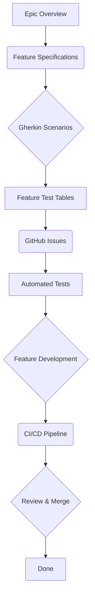

# Spec-to-Test Framework (Unified)

**Repository:** https://github.com/jerryagenyi/sul-messaging-epic

---

## 📚 Table of Contents
1. Background & Purpose
2. Team Development Standards
3. Unified Spec-to-Test Workflow
4. 📊 Summary Table: Artefacts & Locations
5. GitHub Repository Structure
6. Messaging Epic Test Matrix
7. Feature Specification Template
8. Step-by-Step Implementation Guidance
9. Onboarding & Workflow Tips
10. Getting Started for Non-Technical Roles
11. Workflow Visualization
12. Glossary of Terms

---

## 1. Background & Purpose

- Make development seamless and unified for a distributed, volunteer-driven team.
- Reduce bugs and broken code after merges.
- Ensure everyone works from the same clear, testable specifications.
- Minimise onboarding friction and “works on my machine” problems.
- Enable fast, reliable delivery of new features with confidence.

---

## 2. Team Development Standards

- **GitHub Actions is the main gatekeeper for code quality.**
  - All tests and checks run in CI before merging.
  - Multiple workflow YAML files can exist in the `.github/workflows/` folder per repo (frontend and backend). Each YAML file represents a separate workflow (e.g., `run-tests.yml`, `lint.yml`, `deploy.yml`).
- **Documentation, specs, and tests must be clearly organised and accessible in each repo.**

---

## 3. Unified Spec-to-Test Workflow

### Epic-Level Organization
For large features or modules, organize work as: **EPIC > Features > User stories > tasks**

**Epic Structure:**
- **Epic Overview** - High-level business objective and scope
- **Features** - Discrete functional areas within the epic  
- **User Stories** - Specific user needs within each feature
- **Tasks** - Implementation work items (specs, tests, code)

### Workflow Steps

1. **Create Epic Overview**
   - Define epic scope, business value, and feature breakdown
   - **Location:** `/docs/specs/[epic-name]/epic-overview.md`

2. **Write Feature Specifications**
   - Use the provided template (see section 5) for each feature
   - Include: feature title, objective, user stories, Gherkin scenarios, requirements
   - **Location:** `/docs/specs/[epic-name]/feature-[##]-[name].md`

3. **Write Gherkin Scenarios (BDD)**
   - For each user story/acceptance criterion, write Gherkin scenarios
   - These scenarios are the single source of truth for expected behaviour
   - **Location:** `/docs/gherkin/[epic-name]/` or within feature spec files

4. **Create Feature Test Tables**
   - Map Gherkin scenarios to specific tests and track coverage/ownership
   - **Location:** Within each feature spec or `/docs/testing/[epic-name]/`

5. **Generate GitHub Issues/Tasks**
   - Create issues for each feature following "Epic > Feature > User Story > Task" labels
   - Link issues to epic milestone and feature labels

6. **Implement Automated Tests (TDD)**
   - Write tests before or alongside development, guided by Gherkin scenarios
   - **Location:** `/tests/[epic-name]/` or `/src/__tests__/[epic-name]/`

7. **Develop Features**
   - Implement features to pass all tests
   - **Location:** `/src/[epic-name]/` or relevant component directories

8. **Review & Merge**
   - PRs only merged if all tests pass in CI
   - QA and PO review against Gherkin scenarios

---

## 4. 📊 Summary Table: Artefacts & Locations

| Artefact/Step             | Primary Owner | Secondary/Support | Output                        | Tool/Format         | Repo(s)         | Folder/Path                  | File Type         | Est. Time |
|---------------------------|---------------|-------------------|-------------------------------|---------------------|-----------------|------------------------------|-------------------|-----------|
| 0. Epic overview          | PO/PM         | Lead (structure)  | Epic scope & features         | Markdown/Template   | Frontend/Backend| `/docs/specs/[epic-name]/`   | `epic-overview.md`| 1-2 hours |
| 1. Feature specs          | PO/PM         | Lead (review)     | Feature specifications        | Markdown/Template   | Frontend/Backend| `/docs/specs/[epic-name]/`   | `feature-##-name.md`| 2-4 hours |
| 2. Gherkin scenarios      | QA            | PO/PM (input), Lead (review) | Gherkin scenarios     | `.feature` files    | Frontend/Backend| `/docs/gherkin/[epic-name]/` or in feature specs | `.feature`        | 1-2 hours |
| 3. Feature test tables    | Lead          | QA (input)        | Test matrix per feature       | Table/Sheet         | Frontend/Backend| Within feature specs or `/docs/testing/[epic-name]/` | `.md`/spreadsheet | 1-3 hours |
| 4. GitHub issues/tasks    | Lead          | PO/PM (priorities)| Trackable work items          | GitHub Issues       | Frontend/Backend| GitHub Projects              | Issues            | 30min-1hr |
| 5. Write tests            | Dev           | QA (review)       | Automated tests               | Code                | Frontend/Backend| `/tests/[epic-name]/`        | `.js`/`.py`/etc.  | 3-8 hours |
| 6. Implement features     | Dev           | Lead (review)     | Code                          | Code                | Frontend/Backend| `/src/[epic-name]/`          | `.js`/`.vue`/etc. | 4-16 hours|
| 7. Run tests in CI        | GitHub Actions| Dev (fix failures)| Test results                  | GitHub Actions      | Frontend/Backend| `.github/workflows/`          | `.yml`            | Auto     |
| 8. Review & merge         | Lead          | QA (acceptance)   | PR review                     | GitHub              | Frontend/Backend| PRs                          | -                 | 30min-2hr|

---

## 5. GitHub Repository Structure
```
sul-messaging-epic/
├── docs/
│   ├── specs/messaging-epic/
│   ├── gherkin/messaging-epic/
│   └── testing/messaging-epic/
├── src/
├── tests/
└── .github/workflows/
```

---

## 6. Messaging Epic Test Matrix

| Feature | What | Why | How | Edge Cases | Acceptance Criteria | Suggested Test Name |
|---------|------|-----|-----|------------|-------------------|-------------------|
| Role Permissions | Enforce messaging rules | Prevent unauthorized communication | Check user role vs target permissions | Role changes mid-session | Correct button visibility, message sending blocked/allowed | `test_messaging_permissions_enforced()` |
| Admin Settings | Configure messaging rules | Allow platform control | Admin dashboard with setting toggles | Invalid configurations | Settings save and apply immediately | `test_admin_messaging_settings()` |
| Profile Buttons | Initiate conversations | Easy message access | Button on profiles opens messaging | Permission changes | Button appears/disappears correctly | `test_profile_message_button()` |
| Message Interface | Send/receive messages | Core communication | Real-time messaging with search | Network failures, large histories | Messages delivered, search works | `test_messaging_interface()` |
| Search Function | Find conversations | Message retrieval | Text search across messages | Empty results, special characters | Relevant results returned | `test_message_search()` |
| Conversation Grouping | Organize messages | Better UX | Group by participant | Multiple conversations | Messages grouped correctly | `test_conversation_grouping()` |

---

## 7. Feature Specification Template

1. **Feature Title**
2. **Objective / Purpose**
3. **User Stories (BDD-style)**
4. **Acceptance Criteria (Gherkin scenarios)**
5. **Functional Requirements**
6. **Edge Cases & Risks**
7. **Dependencies / API Contracts**
8. **Definition of Done (DoD)**

---

## 8. Step-by-Step Implementation Guidance

1. **Create the Feature Specification Document**
   - Define the feature name, objective, and user stories.
   - List functional requirements and expected user flows.
   - Include edge cases, system dependencies, and risks.
   - Use the full Feature Specification Template for consistency.

2. **Develop the Spec-to-Test Matrix**
   - For each feature, extract: what it does, why it matters, how it behaves, acceptance criteria, suggested unit/component test names.
   - Use one matrix per module or epic, depending on scale.
   - Make the matrix shareable with devs and QA (Google Sheet, Notion table, or Airtable).

3. **Generate Test Cases or Test File Stubs**
   - Draft test case titles from the matrix (e.g., `test_user_can_save_opportunity()`).
   - Work with QA and devs to create placeholder test files:
     - **Frontend:** `ComponentName.test.js` or `.test.jsx`
     - **Backend:** `test_routes.py` or `test_api_save_profile.py`

4. **Create GitHub Issues for Tracking**
   - For each test row: open a GitHub issue, label it as `test-case`, `qa`, or `tdd`, tag the dev or QA responsible, and paste the corresponding row from the table into the issue body.

5. **Draft Dev Workflow Recommendations**
   - Suggest file naming standards (`ComponentName.test.js`)
   - Recommend test placement (next to component or in a `__tests__` folder)
   - Propose a GitHub Actions file to run tests on every PR

6. **Kick Off a Mini Test Alignment Session**
   - Share your document and test table with the team.
   - Run a 15–30 minute sync to assign ownership for each test, confirm spec understanding, and ensure everyone agrees on “definition of done” for the feature.

---

## 9. Onboarding & Workflow Tips

- Gherkin scenarios and the Feature Test Table are required for all new features. Use them as the basis for tests and QA.
- Automated tests must pass in GitHub Actions before merging any PR.
- Keep documentation concise and up to date for easy onboarding.
- Use the summary table above to know exactly where to place each artefact in the repo.

---

## 10. Getting Started for Non-Technical Roles

This section is for Product Owners, Project Managers, and other non-technical stakeholders.

### How to Read Feature Specifications
- **Objective / Purpose:** This tells you why we are building this feature.
- **User Stories:** These describe who will use the feature and what they want to accomplish.
- **Gherkin Scenarios:** These are the most important part for you. They describe, in plain language, how the feature should behave. You can read these to understand exactly what we are building.

### How to Provide Feedback
- **Visual Review Tool:** We use a visual review tool to get your feedback on the UI. This tool will show you a side-by-side comparison of the Figma design and the actual implementation. You can use this to point out any visual differences or suggest improvements.
- **GitHub Issues:** If you have a question or suggestion, you can create a GitHub issue. Please be as specific as possible, and include screenshots if you can.

### High-Level Workflow
1. **Epic Overview:** The Product Owner defines the high-level goals of the epic.
2. **Feature Specifications:** The Product Owner and technical lead work together to create detailed specifications for each feature.
3. **Development:** The development team writes tests and implements the feature.
4. **Review:** The QA team and Product Owner review the feature to ensure it meets the requirements.
5. **Merge:** Once the feature is approved, it is merged into the main codebase.

---

## 11. Workflow Visualization



---

## 12. Glossary of Terms

- **Epic:** A large body of work that can be broken down into a number of smaller stories.
- **User Story:** A short, simple description of a feature told from the perspective of the person who desires the new capability, usually a user or customer of the system.
- **Gherkin:** A business-readable, domain-specific language that lets you describe software’s behavior without detailing how that behavior is implemented.
- **CI/CD:** Continuous Integration and Continuous Delivery. This is a set of practices that automate the process of software delivery.
- **Pull Request (PR):** A request to merge code from one branch into another.
- **Repository (Repo):** A central location in which data is stored and managed.

---

*This framework is designed to keep things simple, unified, and robust for a volunteer-driven, distributed team. Focus on clarity, automation, and shared understanding to reduce bugs and speed up delivery.*